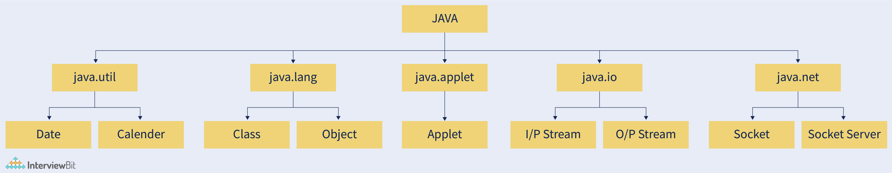
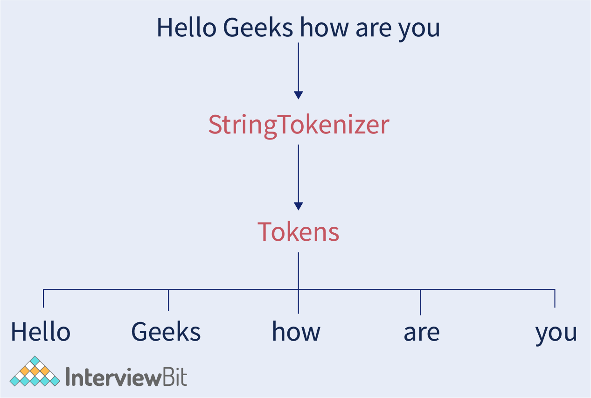
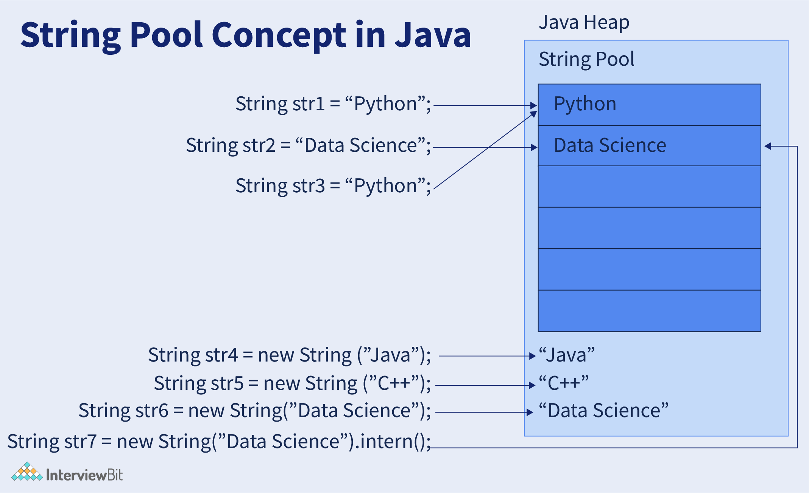
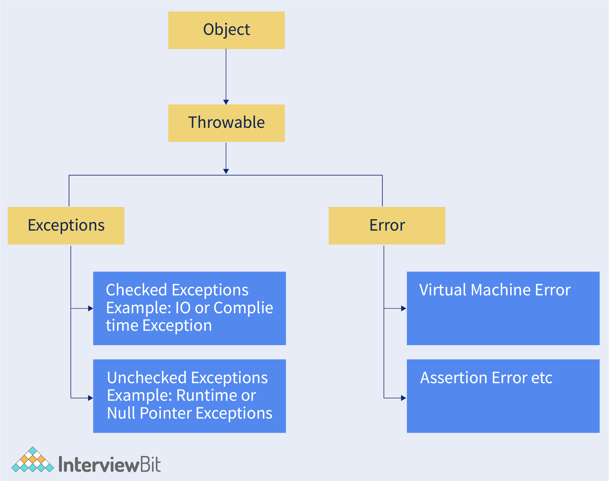

# Java cheatseet

## Reserved Java keywords

| Keyword     | Description                                                                                                          |
|-------------|----------------------------------------------------------------------------------------------------------------------|
| boolean     | Used to declare a variable of boolean type, storing True or False values.                                             |
| byte        | Creates a variable for 8-bit data values.                                                                             |
| break       | Ends a loop or switch statement, interrupting the flow under certain circumstances.                                   |
| abstract    | Declares an abstract class.                                                                                           |
| case        | Used with switch statements to mark text blocks.                                                                      |
| try         | Begins a block of code for error checking, followed by catch or finally block.                                        |
| short       | Declares a variable with 16-bit integer capacity.                                                                     |
| void        | Indicates a method has no return value.                                                                               |
| static      | Denotes a class method or class variable.                                                                             |
| synchronized| Used in multithreaded programming to designate critical sections or functions.                                        |
| super       | A reference variable for parent class objects, used to call parent class methods.                                     |
| volatile    | Indicates a variable might change asynchronously.                                                                     |
| while       | Initiates a while loop, repeating a section many times without a predetermined number of iterations.                   |
| catch       | Captures exceptions thrown by try statements, used after the try block.                                               |
| char        | Declares a variable for unsigned 16-bit Unicode characters.                                                           |
| class       | Used to declare a class.                                                                                              |
| continue    | Continues a loop, skipping remaining code under specific circumstances.                                                |
| default     | Defines a default block in a switch statement or as a default access modifier.                                        |
| do          | Declares a loop, repeating a program section multiple times.                                                          |
| double      | Creates a variable for 64-bit floating-point numbers.                                                                 |
| else        | Represents alternate branches in an if statement.                                                                     |
| enum        | Specifies a set of fixed constants.                                                                                   |
| extends     | Shows class inheritance from another class or interface.                                                              |
| final       | Makes variables constant, methods non-overridable, and classes noninheritable.                                        |
| finally     | Code block in try-catch structure, always executed regardless of exceptions.                                          |
| float       | Creates a variable for 32-bit floating-point values.                                                                  |
| for         | Begins a for loop, executing instructions/functions under a condition.                                                |
| if          | Tests a condition, executing the if block if true.                                                                    |
| implements  | Used to implement an interface.                                                                                       |
| import      | Makes classes and interfaces available in the current source code.                                                    |
| throw       | Used to explicitly throw an exception, commonly for custom exceptions.                                                |
| this        | Refers to the current object in a method or constructor.                                                              |
| throws      | Declares an exception, used to propagate checked exceptions.                                                          |
| instanceof  | Checks if an object is an instance of a class or implements an interface.                                             |
| int         | Declares a variable for a signed 32-bit integer.                                                                      |
| interface   | Used to declare an interface.                                                                                        |
| long        | Specifies a variable for a 64-bit integer.                                                                            |
| native      | Indicates a method is implemented in native code using JNI (Java Native Interface).                                   |
| new         | Used to create new objects.                                                                                           |
| null        | Indicates a reference points to nothing.                                                                              |
| private     | An access modifier indicating a method or variable is accessible only within its declaring class.                     |
| protected   | An access modifier allowing access within and outside the package, but through inheritance only.                       |
| public      | An access modifier indicating unrestricted accessibility.                                                            |
| return      | Exits a method upon completion.                                                                                       |

## Primitive Data types

| Data Type | Default Size | Description                                                                                                                                              |
|-----------|--------------|----------------------------------------------------------------------------------------------------------------------------------------------------------|
| boolean   | 1 bit        | Stores only two values: true and false. Used for simple flags tracking true/false conditions.                                                            |
| char      | 2 bytes      | Represents a single 16-bit Unicode character. Value range from '\u0000' (0) to '\uffff' (65,535).                                                         |
| byte      | 1 byte       | An 8-bit signed two's complement integer with a range from -128 to 127. Used to save memory in large arrays. Default value is 0.                         |
| short     | 2 bytes      | A 16-bit signed two's complement integer with a range from -32,768 to 32,767. Default value is 0.                                                         |
| int       | 4 bytes      | A 32-bit signed two's complement integer with a range from -2^31 to 2^31 - 1.                                                                            |
| long      | 8 bytes      | A 64-bit two's complement integer with a range from -2^63 to 2^63 - 1.                                                                                   |
| float     | 4 bytes      | A 32-bit IEEE 754 floating-point with single precision. Used to save memory in large arrays of floating point numbers.                                   |
| double    | 8 bytes      | A 64-bit IEEE 754 floating-point with double precision. Commonly used for decimal values but not recommended for precise values like currency.            |

## Access modifiers

| Keyword        | Description                                                                                                                                                   |
|----------------|---------------------------------------------------------------------------------------------------------------------------------------------------------------|
| static         | Used to denote a class-level variable or method. It belongs to the class rather than instances of the class.                                                  |
| final          | When applied to a variable, it becomes a constant (its value cannot be changed). For methods, it means the method cannot be overridden. For classes, it prevents them from being subclassed. |
| public         | An access modifier that makes the class, method, or variable accessible from any other class.                                                                  |
| private        | An access modifier that restricts the visibility to the same class only. Cannot be accessed from outside the class.                                            |
| protected      | An access modifier that allows visibility within the same package or subclasses in different packages.                                                         |
| default/package-private | If no access modifier is specified, it's the default. Visible to all classes within the same package but not accessible from outside the package.              |

## Built-in packages


| Package     | Description                                                                                                              |
|-------------|--------------------------------------------------------------------------------------------------------------------------|
| java.lang   | Contains language-specific classes (e.g., classes defining primitive data types, maths operations). Automatically imported. |
| java.io     | Includes classes for handling input and output operations.                                                               |
| java.util   | Contains utility classes that provide data structures like Linked Lists, Dictionary, and Date/Time operations.            |
| java.applet | Contains classes related to Applets.                                                                                     |
| java.awt    | Contains classes for implementing graphical user interface components like buttons, menus, etc.                           |
| java.net    | Includes classes for networking.                                                                                         |

## Abstract Class and Interfaces

### Abstract Class

In C++, a class becomes abstract if it has at least one pure virtual function. In Java, unlike C++, an abstract class is created using a separate keyword `abstract`. The following are some key points to remember about Java abstract classes:

- An abstract class instance cannot be created.
- The use of constructors is permitted.
- There is no need for an abstract method in an abstract class.
- Final methods aren't allowed in abstract classes since they can't be overridden, but abstract methods are designed to be overridden.
- We are prohibited from creating objects for any abstract class.
- In an abstract class, we can define static methods.

### Java Interfaces

An interface, like a class, can include methods and variables, but the methods declared in an interface are abstract by default (only method signature, no body).

- Interfaces define what a class must do, not how it must do it.
- An interface is about capabilities; for example, a Player may be an interface, and any class that implements it must be able to (or must implement) movement().
- As a result, it provides a set of methods that must be implemented by the class.
- If a class implements an interface but does not provide method bodies for all of the interface's functionalities, the class must be declared abstract.

### Abstract Class vs Interface

The following table depicts the differences between abstract classes and interfaces in Java:

| Abstract Class                                                           | Interface                                                                 |
|--------------------------------------------------------------------------|---------------------------------------------------------------------------|
| Abstract and non-abstract methods can both be found in an abstract class. It can also contain default and static methods starting with Java 8. | An interface can only contain abstract methods.                            |
| Non-final variables can be present in abstract classes.                  | Variables declared in a Java interface are by default final variables.     |
| Variables in an abstract class can be final, non-final, static, or non-static. | Only static and final variables are used in the interface.                |
| The interface can be implemented using an abstract class.                | An abstract class cannot be implemented using an interface.               |
| The keyword "extends" can be used to extend an abstract class.           | The keyword "implements" can be used to implement a Java interface.       |

## Strings in Java

Strings are Objects in Java that are internally supported by a char array. Strings are immutable (that is, their content cannot be changed once initialised) because arrays are immutable. Every time you make a change to a String, a new String is produced.

### String Syntax in Java

<String_Type> <string_variable> = "<sequence_of_string>";

In Java, there are two ways to make a string:

- Using String literal:
  
  String str = "Interview Bit";

- Using new keyword:

  String str = new String("Interview Bit");

### Difference between String Literal and String Object

| String Literal | String Object |
|----------------|---------------|
| In Java, a string literal is a collection of characters formed by enclosing them in a pair of double-quotes. | String Object is a Java object that represents a set of characters produced with the new() operator. |
| If the String already exists in a literal, the new reference variable will point to the currently existing literal. | A new String object will be produced whether the String currently exists or not. |
| The syntax for creating a String literal is as follows: String string_name = “CONTENT_OF_STRING”; | The syntax for creating a String object is as follows: String object_name = new String(“CONTENT_OF_STRING”); |

### String Pool

String pool is a Java heap storage area where string literals are stored. String Intern Pool or String Constant Pool are other names for it. It’s the same as object allocation. It is empty by default and is maintained privately by the Java String class. When we create a string, the string object takes up some memory in the heap. Creating a large number of strings may raise the cost and memory requirements, lowering performance.

During the initialization of string literals, the JVM takes several efforts to improve efficiency and reduce memory usage. The String class keeps a pool of strings to reduce the number of String objects created in the JVM. When we construct a string literal, the JVM looks it up in the String pool first. It returns a reference to the pooled instance if the literal is already existing in the pool. If the literal isn’t found in the pool, the String pool is filled with a new String object.




### Commonly Used String Methods in Java

| Method          | Return Type | Use Case                                                                                         |
|-----------------|-------------|--------------------------------------------------------------------------------------------------|
| charAt()        | char        | Returns the character at the specified index.                                                    |
| length()        | int         | Returns the length of the string.                                                                |
| substring()     | String      | Generates a substring of the string from a specified index.                                      |
| equals()        | boolean     | Compares two strings for equality.                                                               |
| equalsIgnoreCase() | boolean  | Compares two strings for equality, ignoring case differences.                                    |
| startsWith()    | boolean     | Checks if the string starts with the specified characters.                                       |
| endsWith()      | boolean     | Checks if the string ends with the specified characters.                                         |
| indexOf()       | int         | Returns the index within the string of the first occurrence of the specified character(s).        |
| lastIndexOf()   | int         | Returns the index within the string of the last occurrence of the specified character(s).        |
| replace()       | String      | Returns a new string resulting from replacing all occurrences of old characters in the string with new characters. |
| toLowerCase()   | String      | Converts all characters in the string to lower case.                                             |
| toUpperCase()   | String      | Converts all characters in the string to upper case.                                             |
| trim()          | String      | Removes whitespace from both ends of the string.                                                 |
| split()         | String[]    | Splits the string around matches of the given regular expression, returning an array.             |
| contains()      | boolean     | Checks if the string contains the specified sequence of char values.                             |

## Exceptions

### Meaning of Exception
An exception is an unwelcome or unexpected occurrence that happens during the execution of a program, i.e., at runtime, disrupting the normal flow of program instructions.

### Error vs Exception: What is the Difference?

- **Error:** Implies a significant problem that a reasonable program should not attempt to solve.
- **Exception:** Denotes a set of circumstances that a reasonable program would try to catch.

### Hierarchy of Exceptions

All exception and error types are subclasses of the hierarchy's root class, `Throwable`. Exceptions can be divided into two categories:

- **Checked Exceptions:** Includes IO Exceptions and Compile time Exceptions.
- **Unchecked Exceptions:** Includes Runtime Exceptions and Null Pointer Exceptions.

### Built-in Exceptions in Java

Exceptions present in Java libraries are known as built-in exceptions. The following table lists the built-in exceptions in Java:

| Exception                     | Description                                                                                                    |
|-------------------------------|----------------------------------------------------------------------------------------------------------------|
| ArithmeticException           | Thrown when an unusual condition occurs in an arithmetic operation.                                            |
| ArrayIndexOutOfBoundsException| Thrown when an array is accessed with an incorrect index, either negative or greater than the array's size.    |
| ClassNotFoundException         | Thrown when attempting to access a class whose definition is missing.                                          |
| FileNotFoundException         | Thrown when a file is not accessible or cannot be opened.                                                      |
| IOException                   | Issued when an input-output operation fails or is interrupted.                                                 |
| InterruptedException          | Issued when a thread is interrupted while waiting, sleeping, or processing.                                    |
| NoSuchFieldException          | Thrown when a class does not have the requested field (or variable).                                           |
| NoSuchMethodException         | Thrown when attempting to call a method that doesn't exist.                                                    |
| NullPointerException           | Thrown when referring to members of a null object.                                                             |
| NumberFormatException         | Thrown when a method can’t convert a string into a numeric format.                                             |
| RuntimeException               | Represents any exception that occurs during runtime.                                                           |
| StringIndexOutOfBoundsException | Thrown by String class methods when an index is either negative or larger than the string's size.              |



## Java Generics

Generics refer to types that have been parameterized. The goal is to make type (Integer, String, etc., as well as user-defined types) a parameter for methods, classes, and interfaces. Generics can be used to design classes that function with a variety of data types. A generic entity is a type that works on a parameterized type, such as a class, interface, or method. In Java, generics are equivalent to templates in C++. Generics are used extensively in classes such as HashSet, ArrayList, HashMap, and others.

## Generic class:

In the same way that C++ specifies parameter types, we use <> to define parameter types in generic class formation. The following syntax is used to construct generic class objects:

```java
ClassName<Type> obj = new ClassName<Type>()
```

Here, ‘ClassName’ denotes the name of the class whose instance is to be created. `<Type>` specifies the data type to be used while instantiating the object. ‘obj’ is the name of the object to be created.

#### Example -

```java
class Sample<T> {
    T obj;
    Sample(T obj) {  
        this.obj = obj;  
    }  
    public T getObject() { 
        return this.obj; 
    }
}

class Test {
    public static void main (String[] args) {
        // instance of Integer type
        Sample<Integer> obj1 = new Sample<Integer>(10);
        System.out.println(obj1.getObject());

        // instance of String type
        Sample<String> obj2 = new Sample<String>("Interview Bit");
        System.out.println(obj2.getObject());
    }
}
```

Output:
```
10
Interview Bit
```


In the above example, a generic class Sample has been created which accepts a parameter T to determine the type of the class. We create 2 instances of the Sample class. One with an Integer type and the other with a String type.

The following are the advantages of using generics in Java:

- **Type-safety:** We can only hold one type of object in generics. It does not allow for the storage of objects of different types. Example:

  ```java
  List list = new ArrayList();    
  list.add(1);  
  list.add("Interview Bit");
  ```

  The above code snippet runs fine. This is because we have not specified any type while creating an instance of the List class. However, if we run the below code snippet, we get a compile-time error.

  ```java
  List<Integer> list = new ArrayList<Integer>();    
  list.add(1);  
  list.add("Interview Bit");// compile-time error
  ```

- **Typecasting isn’t necessary:** When we use generics, we do not need to typecast the object.

  ```java
  List list = new ArrayList();    
  list.add("Interview Bit");    
  String s = (String) list.get(0);//typecasting  
  ```

  However, if we declare the list instance with a specific type, no explicit typecasting is needed:

  ```java
  List<String> list = new ArrayList<String>();    
  list.add("Interview bit");    
  String s = list.get(0);
  ```

- **Checking at Compile Time:** Ensures that issues are caught at compile time rather than at runtime.

  ```java
  List<String> list = new ArrayList<String>();    
  list.add("Interview Bit");    
  list.add(100);//Compile Time Error  
  ```

## Important Java Data Structures for Interviews

### Overview

Java provides several data structures that are frequently used in interviews, such as HashMaps, ArrayLists, Trees, and others. Understanding their functionalities and time complexities is crucial for efficient coding.

### Time Complexities

| Data Structure | Average Access | Average Search | Average Insertion | Average Deletion |
|----------------|----------------|----------------|-------------------|------------------|
| ArrayList      | O(1)           | O(n)           | O(n)              | O(n)             |
| LinkedList     | O(n)           | O(n)           | O(1)              | O(1)             |
| HashMap        | N/A            | O(1)           | O(1)              | O(1)             |
| TreeMap        | N/A            | O(log n)       | O(log n)          | O(log n)         |
| HashSet        | N/A            | O(1)           | O(1)              | O(1)             |
| TreeSet        | N/A            | O(log n)       | O(log n)          | O(log n)         |

### Important Methods

#### ArrayList

- `add(E e)`: Adds an element to the end of the list.
- `get(int index)`: Returns the element at the specified position.
- `remove(int index)`: Removes the element at the specified position.
- `size()`: Returns the number of elements in the list.

#### LinkedList

- `add(E e)`: Adds an element to the end of the list.
- `get(int index)`: Returns the element at the specified position.
- `remove(int index)`: Removes the element at the specified position.
- `size()`: Returns the number of elements in the list.

#### HashMap

- `put(K key, V value)`: Associates the specified value with the specified key.
- `get(Object key)`: Returns the value to which the specified key is mapped.
- `remove(Object key)`: Removes the mapping for the specified key.

#### TreeMap

- `put(K key, V value)`: Associates the specified value with the specified key.
- `get(Object key)`: Returns the value to which the specified key is mapped.
- `remove(Object key)`: Removes the mapping for the specified key.

#### HashSet

- `add(E e)`: Adds the specified element to this set if it is not already present.
- `contains(Object o)`: Returns true if this set contains the specified element.
- `remove(Object o)`: Removes the specified element from this set if it is present.

#### TreeSet

- `add(E e)`: Adds the specified element to this set if it is not already present.
- `contains(Object o)`: Returns true if this set contains the specified element.
- `remove(Object o)`: Removes the specified element from this set if it is present.

This overview provides a basic understanding of common data structures in Java, their time complexities, and key methods. These data structures are integral to many interview questions and practical applications.
